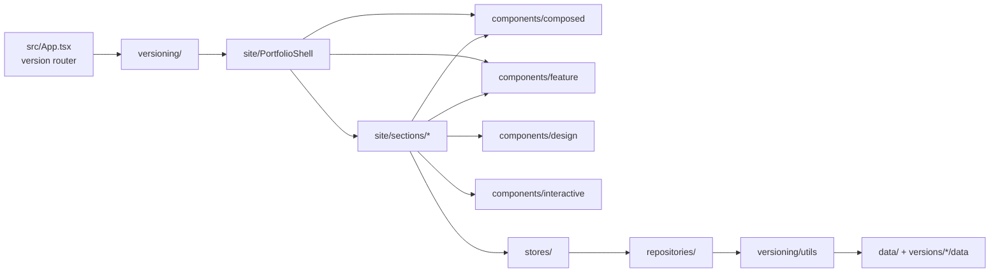

# Architecture

포트폴리오 정적 SPA (React + Vite). 백엔드/DB 없음. 배포는 정적 호스팅.

## Overview

## Frontend layout (`src/`)

| Path | Role |
|------|------|
| `App.tsx` | 버전 해시 라우팅 (`/:versionHash`) |
| `site/` | 포트폴리오 UI 셸 + 섹션 (`PortfolioShell`, `sections/`) |
| `components/design/` | 표면 SSOT — Icon / Text / Chip / Tag / Card / Heading / CodeBlock + tokens·surface·opacity |
| `components/interactive/` | 인터랙션 — *Button / Toggle·Cycle IconButton / SearchField / CodeField / SegmentedButton / ControlSlider / Modal / FlipCard |
| `components/composed/` | 도메인 맥락 래퍼 — Status/Stack/Skill/Search Chip, TypedExternalLink, FieldCard, ExperienceSlotCard, ProjectSlotCard, NavButton, CardCursor, Nav |
| `components/feature/` | 앱 기능 완성형 — Settings*, Theme/Language, ProjectSort/Search, SearchShortcut, Copy/ContactField/ExperienceCard/ProjectCard, ControlSliders |
| `hooks/` | 앱 전역 훅만 (섹션 훅은 `site/sections/*/hooks` 또는 섹션 옆) |
| `data/`, `models/`, `repositories/`, `stores/` | 데이터 → 모델 → 로드 → 상태 |
| `versioning/utils/` | 순수 로드 util (`loadData` replace, `loadIntroLinks` merge) |
| `versioning/files.ts`, `globs.ts` | DATA_FILE 상수, Vite glob 맵 (util 아님) |
| `versioning/providers/` | `VersionProvider` / `useVersion({ hash })` / bridges / entry |
| `versions/` | 버전별 데이터·섹션 오버레이 |
| `analytics/` | 이벤트 전송·사이트 뷰·검색 메타 (`@analytics`) |
| `assets/icons/ui/outline/` · `fill/` | UI 아이콘 SVG **1:1** (`Icon variant="outline"|"fill"`). 셸은 `surface` |
| `assets/icons/brand/` | 브랜드·제품·기술 로고 SVG (`BrandIcons` 상수) |
| `assets/icons/logo/` | 사이트·제품 마크 SVG (`LogoIcons` 상수, 예: pano) |
| `site/sections/*/…` | 섹션 로컬 헬퍼·데이터 훅 (`useVersionedLoad` 기반) |
| `stores/focusIdStore` | docs/experience 포커스 핸드오프 |
| `hooks/useVersionedLoad`, `hooks/viewportFade` | lang+hash 로드 / 스크롤 페이드 공용 |
| `config.ts` | SSOT: animation(`--anim-*`), breakpoints, scale min/max, contact/version |
| `pages/components/` | `/components` 갤러리 — Structure + Role(Design/Interactive/Composed/Feature) \| Domain View |
| `pages/guides/` | `/responsive`, `/accessibility` 등 원칙 전시관 — live lab + 스니펫 |

## Component layers

- **Design** — variant / size / opacity / shape 표면. 클릭·href 없음. CodeBlock은 읽기 전용 코드 표시(grayscale highlight · `height` hug/stretch · `showLine`). 편집은 Interactive CodeField.
- **Interactive** — `<button>`/`<a>` + aria + onClick. Design을 감싼다. ToggleIconButton(이진)·CycleIconButton(N상태)·SearchField(`size`×`width`)·CodeField(Tab/Shift+Tab/Option+↑↓, `language`·`showLine`, 커스텀 resize) 포함.
  - 전역 피드백: `.hoverable`=음영, `.clickable`=press scale. `pressFeedbackClass('press'|'shade'|'press-shade')`. Goto/Nav=`press`, Text/Chip/Icon=`press-shade`, Skill=`shade`.
- **Composed** — 도메인 맥락 래퍼 (store/modal 없는 의미 래핑). SearchChipButton, TypedExternalLink, FieldCard 등.
- **Feature** — 앱 기능 완성형 (configStore·검색 store·팝업 등). ProjectSortButton / ProjectSearchField / SearchShortcutChipButton / SettingsModal 등.

### Layout axes
- **size** — large/medium/small (컨트롤 스케일)
- **width** — `hug` | `stretch` (콘텐츠 vs 부모 폭). size와 직교. GotoButton / SearchField에서 사용.

## Version 로드 정책

- **replace** (`loadData`, `loadSection`): 버전 파일이 있으면 그 모듈, 없으면 common/site.
- **merge** (`loadIntroLinks`): 공통 정의 위에 버전 패치를 shallow merge.

## Backend / DB / Infra

- Backend: 없음 (정적 프론트엔드)
- DB: 없음 (번들 내 TS 데이터)
- Infra: 정적 호스팅 (기존 배포 경로 유지)
